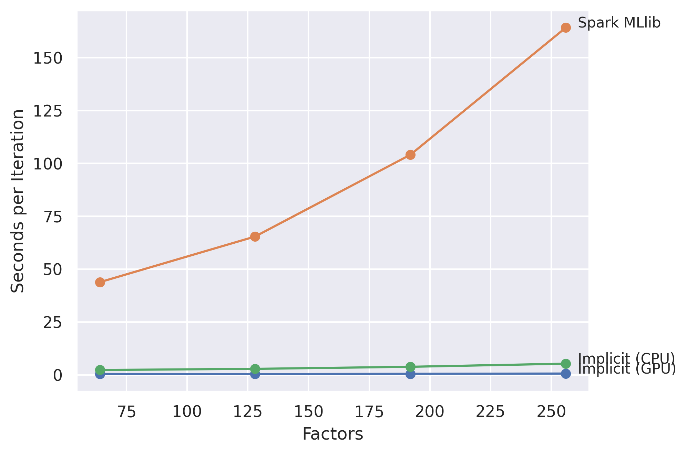
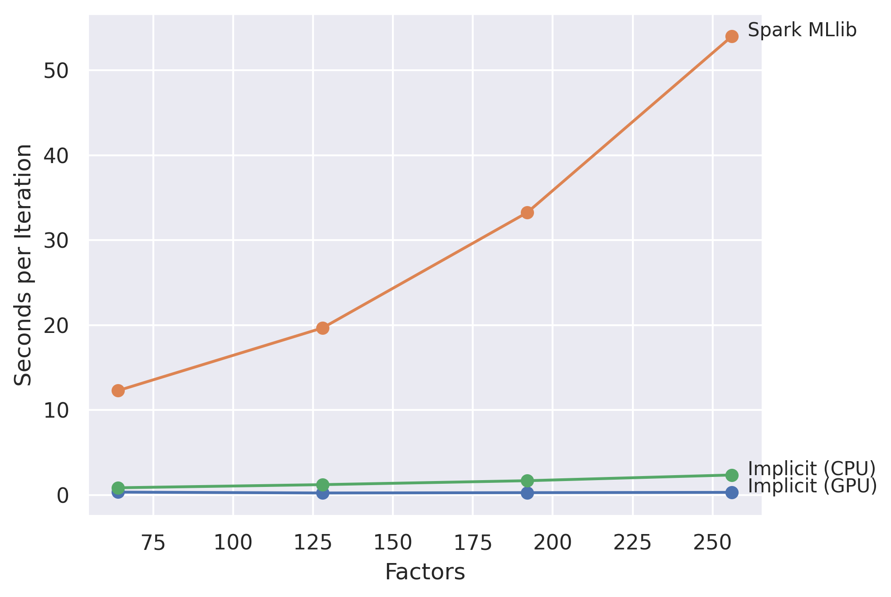

Benchmarks
==========

All benchmarks reported here were performed on an Intel i7-7820x CPU. GPU Benchmarks were done
on a NVIDIA GTX 1080 Ti.

### Spark Comparison

The benchmark_spark.py script compares the AlternatingLeastSquares model found here
to the implementation found in [Spark MLlib](https://spark.apache.org/mllib/).

To run this comparison, you should first [compile Spark with native BLAS
support](https://github.com/Mega-DatA-Lab/SpectralLDA-Spark/wiki/Compile-Spark-with-Native-BLAS-LAPACK-Support
).

This benchmark compares the Conjugate Gradient solver found in implicit on both the CPU and GPU,
to the Cholesky solver used in Spark.

The times per iteration are average times over 5 iterations.

#### last.fm 360k dataset

For the lastm.fm dataset at 256 factors, implicit on the CPU is 30x faster than Spark and the GPU version of implicit is
 93x faster than Spark:

<!--
{'Implicit (CPU)': {64: 1.3660077571868896,
  128: 2.5609301567077636,
  192: 3.6533109664916994,
  256: 5.476823997497559},
 'Implicit (GPU)': {64: 0.7076258182525634,
  128: 0.9427927494049072,
  192: 1.3412117958068848,
  256: 1.7588469505310058},
 'Spark MLlib': {64: 43.841095733642575,
  128: 65.43235535621643,
  192: 104.12412366867065,
  256: 164.2230523586273}}
-->

#### MovieLens 20M dataset

For the ml20m dataset at 256 factors, implicit on the CPU was 8x faster than Spark while the GPU version
was 68x faster than Spark:

<!--
{'Implicit (CPU)': {64: 2.7515282154083254,
  128: 4.217876005172729,
  192: 5.335603475570679,
  256: 6.5248472690582275},
 'Implicit (GPU)': {64: 0.3966668605804443,
  128: 0.44752702713012693,
  192: 0.6295590400695801,
  256: 0.7912652492523193},
 'Spark MLlib': {64: 12.285535764694213,
  128: 19.666392993927,
  192: 33.25573806762695,
  256: 54.00092940330505}}
-->

Note that this dataset was filtered down for all versions to reviews that were positive (4+
stars), to simulate a truly implicit dataset.

Implicit on the CPU seems to suffer a bit here relative to the other options. It seems like there might
be a single threaded bottleneck at some point thats worth examining later.
