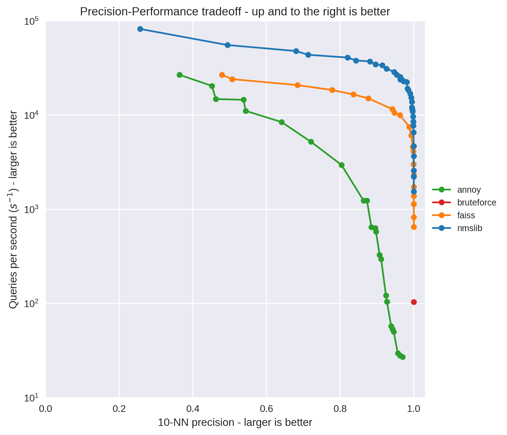

Approximate Nearest Neighbours
==============================

This library supports using a couple of different approximate nearest neighbours libraries
to speed up the recommend and similar_items methods of any Matrix Factorization model.

The potential speedup of using these methods can be quite significant, at the risk of
potentially missing relevant results:

See `this post comparing the different ANN libraries
<http://www.benfrederickson.com/approximate-nearest-neighbours-for-recommender-systems/>`_ for
more details.

NMSLibModel
-----------
.. autoclass:: implicit.ann.nmslib.NMSLibModel
   :members:
   :show-inheritance:

AnnoyModel
----------
.. autoclass:: implicit.ann.annoy.AnnoyModel
   :members:
   :show-inheritance:

FaissModel
----------
.. autoclass:: implicit.ann.faiss.FaissModel
   :members:
   :show-inheritance:
